# Architecture Diagram

Visual companion to `docs/ARCHITECTURE.md`. The prose doc is the source of truth for
details; this diagram is the at-a-glance view of the live component layout.

## Legend

| Style | Meaning |
|---|---|
| **Blue solid** | Live cyboflow-differentiator paths (review queue stores, live tRPC procedures, live raw IPC, the approval lifecycle). |
| **Amber solid** | Intentional extension point that must not be collapsed (`AbstractCliManager`). |
| **Amber dashed** | Deprecated/superseded stub kept in source (the legacy `cyboflow:approveRun` raw IPC, now replaced by the `cyboflow.approvals.*` tRPC path). |

> **History:** an earlier revision of this diagram showed an unbuilt "approval-router epic 7"
> cluster (`permissionIpcServer` + `ApprovalRouter`). That work has since shipped — `ApprovalRouter`
> (`main/src/orchestrator/approvalRouter.ts`) and the orchestrator Unix-domain socket
> (`~/.cyboflow/sockets/orch.sock`, stood up in `main/src/index.ts`) are live and load-bearing,
> and the `cyboflow.approvals.*` / `runs.*` / `workflows.*` tRPC procedures are live. The only
> remaining stub is the superseded `cyboflow:approveRun` raw IPC handler.

## Diagram

```mermaid
graph TB
    subgraph User["User Layer"]
        UI[React Renderer<br/>Vite 6 + Tailwind]
    end

    subgraph Electron["Electron 37.6 Process Boundary"]

        subgraph Renderer["Renderer Process - frontend/"]
            App[App.tsx]
            Panels[Panel Components<br/>ai / claude / cli / diff / editor / logPanel]
            subgraph Stores["Zustand Stores"]
                CrystalStores[Crystal-baseline<br/>session / panel / config / navigation /<br/>error / sessionHistory / sessionPreferences /<br/>slashCommand]
                CyboflowStores[Cyboflow-era<br/>cyboflowStore / mcpHealthStore /<br/>reviewQueueStore + Slice]
            end
            RawAPI[utils/api.ts +<br/>utils/cyboflowApi.ts<br/>Raw IPC wrapper]
            TrpcClient[trpc/client.ts<br/>typed tRPC client]

            App --> Panels
            App --> Stores
            Panels --> RawAPI
            Panels --> TrpcClient
            CyboflowStores --> TrpcClient
            CyboflowStores --> RawAPI
        end

        Preload[preload.ts<br/>contextBridge +<br/>exposeElectronTRPC]

        subgraph Main["Main Process - main/"]

            subgraph IPC["IPC Surfaces"]
                RawIPC["Raw ipcMain handlers<br/>main/src/ipc/<br/>session / git / panels / cyboflow"]
                AppRouter["tRPC appRouter<br/>main/src/orchestrator/trpc/router.ts<br/>cyboflow.{runs, approvals,<br/>workflows, events, health}"]
            end

            subgraph CyboflowIPC["cyboflow.* transport status"]
                direction TB
                LiveRaw["LIVE raw IPC<br/>listWorkflows / startRun /<br/>listRuns / mcp-health"]
                DeprecatedRaw["DEPRECATED raw IPC<br/>cyboflow:approveRun<br/>returns NOT_IMPLEMENTED<br/>(superseded by approvals.*)"]
                LiveTrpc["LIVE tRPC<br/>runs.{list, cancel, cancelAndRestart,<br/>getStuckInspection} · workflows.list<br/>approvals.{listPending, approve, reject,<br/>approveRestOfRun, rejectRestOfRun}"]
            end

            subgraph Orch["Orchestrator - main/src/orchestrator/<br/>standalone-typecheck invariant"]
                Core[Orchestrator<br/>start/stop lifecycle]
                RunQueues[RunQueueRegistry<br/>p-queue per run]
                StuckDet[StuckDetector<br/>per-component EventEmitter]
                Bridge[runEventBridge<br/>documented exception:<br/>imports streamParser]
                MapPerm[permissionModeMapper<br/>buildPreToolUseHook]
                Helper[preToolUseHookHelper<br/>routePreToolUseThroughApprovalRouter]
                ApprovalRtr[ApprovalRouter<br/>DB-backed approval lifecycle<br/>requestApproval / respond + resolver]
                OrchSock[Orchestrator IPC<br/>Unix socket orch.sock<br/>index.ts socket server]
                Core --> RunQueues
                Core --> StuckDet
                Core --> Bridge
                MapPerm --> Helper
                Helper --> ApprovalRtr
                ApprovalRtr --> OrchSock
            end

            subgraph Services["Services - main/src/services/"]
                Session[sessionManager]
                Worktree[worktreeManager<br/>git worktree add -b]
                StreamP[streamParser<br/>EventRouter / RawEventsSink]
                Factory[cliManagerFactory]

                subgraph CLI["panels/cli/ + panels/claude/"]
                    Abstract[AbstractCliManager<br/>EXTENSION POINT<br/>owns PTY spawn path]
                    Claude[ClaudeCodeManager<br/>Agent SDK query in-process<br/>overrides spawn]
                    Interactive[InteractiveClaudeManager<br/>PTY substrate sibling]
                    Abstract -.subclass.-> Claude
                    Abstract -.subclass.-> Interactive
                end

                subgraph PtyMgrs["Live PTY users"]
                    Term1[terminalSessionManager]
                    Term2[terminalPanelManager]
                    RunCmd[runCommandManager]
                end

                Factory --> Abstract
            end

            subgraph Data["Data Layer"]
                DB[(better-sqlite3 11.7<br/>~/.cyboflow/<br/>WAL mode)]
                Schema[schema.sql +<br/>migrations 003..030<br/>2-phase runner]
                DB --- Schema
            end

            subgraph MCP["MCP Subprocess (asarUnpack)"]
                McpSrv[cyboflowMcpServer.js<br/>stdio - separate node proc]
            end

            RawIPC --> Services
            RawIPC --> Core
            AppRouter --> Core
            AppRouter --> Services
            AppRouter --> ApprovalRtr

            Core --> Services
            Bridge --> StreamP
            Claude --> MapPerm
            Claude -. injects orchSocketPath .-> McpSrv
            McpSrv -. approval requests over .-> OrchSock
        end
    end

    subgraph External["External Processes"]
        Git[git worktrees on disk]
    end

    UI --> App
    RawAPI <-.contextBridge.-> Preload
    TrpcClient <-.electron-trpc.-> Preload
    Preload <-.invoke / tRPC.-> IPC

    Worktree --> Git
    Term1 -. PTY .-> ExternalPty[zsh / shell processes]
    Term2 -. PTY .-> ExternalPty
    RunCmd -. PTY .-> ExternalPty

    subgraph Shared["shared/types/ - contract layer"]
        Types[Crystal: models / panels / cliPanels / aiPanelConfig<br/>Cyboflow: cyboflow / workflows / approvals /<br/>mcpHealth / stuckDetection / unifiedMessage<br/>Transport: trpc - re-exports AppRouter]
    end

    Renderer -.imports.-> Shared
    Main -.imports.-> Shared

    classDef extension fill:#fef3c7,stroke:#f59e0b,stroke-width:2px,color:#000
    classDef stub fill:#fef3c7,stroke:#f59e0b,stroke-dasharray: 4 3,color:#000
    classDef product fill:#dbeafe,stroke:#3b82f6,stroke-width:2px,color:#000
    class Abstract extension
    class DeprecatedRaw stub
    class LiveRaw,LiveTrpc,ApprovalRtr,OrchSock product
    class CyboflowStores product
```

## Reading the approval path (now live)

The approval lifecycle that an earlier revision marked "not yet built" is the live path today:

- `permissionModeMapper` / `preToolUseHookHelper` route a tool-use decision into
  `ApprovalRouter` (`main/src/orchestrator/approvalRouter.ts`), which co-writes the `approvals`
  row, the `workflow_runs` status fold, and a blocking `review_items` inbox row inside one
  `db.transaction()`, then resolves the in-process `decisionPromise` on `respond()`.
- The MCP subprocess reaches the orchestrator over the Unix-domain socket
  (`~/.cyboflow/sockets/orch.sock`) stood up in `main/src/index.ts`; `ClaudeCodeManager`
  injects the live `orchSocketPath` into spawned sessions.
- The renderer's `reviewQueueStore` reads/writes via the live `cyboflow.approvals.*` tRPC
  procedures (`listPending` / `approve` / `reject` / `approveRestOfRun` / `rejectRestOfRun`).

The only remaining stub is the legacy `cyboflow:approveRun` **raw** IPC handler, which returns
`NOT_IMPLEMENTED` and is superseded by the tRPC approvals path above.
